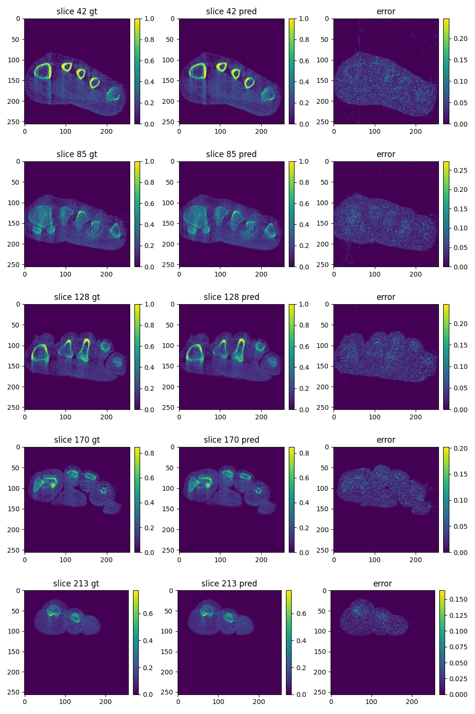
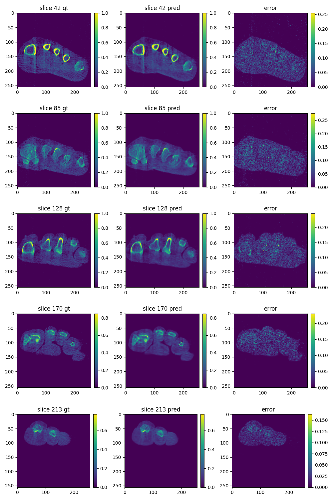

## Overview
This library is an implementation of Gaussian Voxelizer, which is similar to [r2_gaussian](https://github.com/Ruyi-Zha/r2_gaussian).
What r2_gaussian is doing is applying [3D-GS](https://github.com/graphdeco-inria/gaussian-splatting) in the field of CBCT, as can be seen in their [repository](https://github.com/Ruyi-Zha/r2_gaussian).

There are some differences between our voxelizer and theirs:
1. r2_gaussian first convert the 3D Gaussians to a voxel space and then take the volume, while we directly extract the volume from the world space.
2. At present, our performance is worse than r2_gaussian's.

The overall structure of the project and some codes are referenced from 3D-GS.
And this project was completed before r2_gaussian was open sourced.
However, the part that calculates the Gaussian radius is based on the reference r2_gaussian (at that time, I didn't know that the radius could be calculated directly based on the scale)
## Installation
```sh
git clone https://github.com/immortalmin/Gaussian-Voxelizer.git

cd Gaussian-Voxelizer
pip install .
```

## Usage
```Python
from diff_gaussian_voxelization import GaussianVoxelizationSettings, GaussianVoxelizer

voxel_settings = GaussianVoxelizationSettings(
    voxel_physical=voxel_physical,      # the physical size of a voxel. e.g. torch.tensor([0.001, 0.001, 0.001])
    volume_pixel=volume_pixel,          # the pixel size of the volume. e.g. torch.tensor([128, 128, 128])
    volume_center=volume_center,        # the center of the volume. e.g. torch.tensor([0, 0, 0])
    debug=False
)

voxelizer = GaussianVoxelizer(voxel_settings=voxel_settings)
# res_cuda is a 3D matrix representing the volume
res_cuda, radii_cuda = voxelizer(
    self.gaussians.get_xyz,
    self.gaussians.get_density,
    self.gaussians.get_scaling,
    self.gaussians.get_rotation
)
```

## Experiments
We replaced the voxelizer in r2_gaussian with ours and tested it on the foot dataset with 30000 iterations.

|           | r2_gaussian |   ours    |
|:---------:|:-----------:|:---------:|
|   PSNR    |    31.89    |   31.51   |
|   SSIM    |   0.8769    |  0.8749   |
|   TIME    |  12.31 min  | 15.65 min |
| #Gaussian |    56518    |   57308   |

r2_gaussian:

ours:

